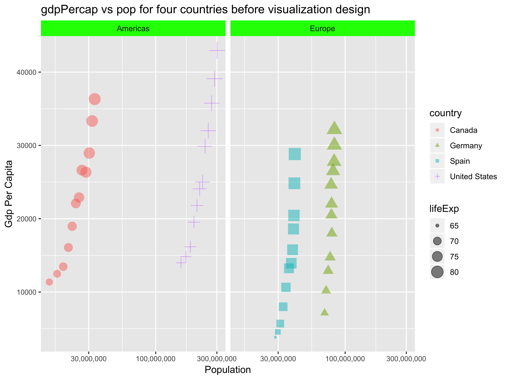

assignment 5
================

# Homework 05: Factor and figure management

## Part 1: Factor Management

With the data set of your choice, after ensuring the variable(s) you’re
exploring are indeed factors, you are expected to:

Drop factor / levels; Reorder levels based on knowledge from data.

``` r
# load required libraries
suppressPackageStartupMessages(library(gapminder))
suppressPackageStartupMessages(library(tidyverse))
suppressPackageStartupMessages(library(plotly))
suppressPackageStartupMessages(library(ggplot2))
suppressPackageStartupMessages(library(gplots))
suppressPackageStartupMessages(library(scales))
```

### Drop Oceania

Filter the Gapminder data to remove observations associated with the
continent of Oceania. Additionally, remove unused factor levels. Provide
concrete information on the data before and after removing these rows
and Oceania; address the number of rows and the levels of the affected
factors.

To drop the continent of Oceania, apply `filter()`

``` r
gapminder_no_oceania <- gapminder %>% 
  filter(continent != "Oceania")
```

To take a glance at
    gapminder\_no\_oceania:

``` r
str(gapminder_no_oceania)
```

    ## Classes 'tbl_df', 'tbl' and 'data.frame':    1680 obs. of  6 variables:
    ##  $ country  : Factor w/ 142 levels "Afghanistan",..: 1 1 1 1 1 1 1 1 1 1 ...
    ##  $ continent: Factor w/ 5 levels "Africa","Americas",..: 3 3 3 3 3 3 3 3 3 3 ...
    ##  $ year     : int  1952 1957 1962 1967 1972 1977 1982 1987 1992 1997 ...
    ##  $ lifeExp  : num  28.8 30.3 32 34 36.1 ...
    ##  $ pop      : int  8425333 9240934 10267083 11537966 13079460 14880372 12881816 13867957 16317921 22227415 ...
    ##  $ gdpPercap: num  779 821 853 836 740 ...

To show the continents in gapminder\_no\_oceania:

``` r
unique(gapminder_no_oceania$continent)
```

    ## [1] Asia     Europe   Africa   Americas
    ## Levels: Africa Americas Asia Europe Oceania

We can see from the result that Oceania is removed from gapminder.
However, levels remain the same.

To remove the unused factor levels:

``` r
gapminder_no_oceania <- gapminder_no_oceania %>% 
  # drop Oceania level since it's unused
  droplevels()

unique(gapminder_no_oceania$continent)
```

    ## [1] Asia     Europe   Africa   Americas
    ## Levels: Africa Americas Asia Europe

Now Oceania level is removed from
    levels.

``` r
str(gapminder_no_oceania)
```

    ## Classes 'tbl_df', 'tbl' and 'data.frame':    1680 obs. of  6 variables:
    ##  $ country  : Factor w/ 140 levels "Afghanistan",..: 1 1 1 1 1 1 1 1 1 1 ...
    ##  $ continent: Factor w/ 4 levels "Africa","Americas",..: 3 3 3 3 3 3 3 3 3 3 ...
    ##  $ year     : int  1952 1957 1962 1967 1972 1977 1982 1987 1992 1997 ...
    ##  $ lifeExp  : num  28.8 30.3 32 34 36.1 ...
    ##  $ pop      : int  8425333 9240934 10267083 11537966 13079460 14880372 12881816 13867957 16317921 22227415 ...
    ##  $ gdpPercap: num  779 821 853 836 740 ...

Before `droplevels()`, gapminder\_no\_oceania data frame has 142 levels
for country, 5 levels for continent. Since continent Oceania has two
countries, after `droplevels()`, the country level decreased to 140 and
continent level decreased to 4.

### Reorder the levels of continent

I tried to reorder the continent with standard deviation of lifeExp over
years. Before reordering, let’s take a look at the levels of continent
first.

``` r
levels(gapminder_no_oceania$continent) %>% 
  head()
```

    ## [1] "Africa"   "Americas" "Asia"     "Europe"

``` r
# compute standard deviation for continents for later labelling
summ <- gapminder_no_oceania %>% 
  group_by(continent) %>% 
  summarise(sd = sd(lifeExp))
knitr::kable(summ)
```

| continent |        sd |
| :-------- | --------: |
| Africa    |  9.150210 |
| Americas  |  9.345088 |
| Asia      | 11.864532 |
| Europe    |  5.433178 |

Before apply factor re-leveling, first try to see the effect for
`arrange()`.

``` r
gapminder_no_oceania %>% 
  arrange(desc(lifeExp)) %>% 
  ggplot(aes(continent, lifeExp))+
  geom_point(aes(color = continent), alpha = 0.1) +
  geom_boxplot(aes(fill = continent), alpha = 0.25) +
  # label the standard deviation since it cannot be seen from boxplot clearly
  geom_label(data = summ, aes(x = continent, y = sd, 
    label = paste("SD: ", round(sd, 1)))) + 
  ggtitle("Effect of arrange() before releveling") + 
  theme_bw()
```


From the plot, standard deviation can somehow related to the box size.
However, to be clear, I use `geom_lable()` to label the standard
deviation values. We can see that `arrange()` doesn’t have any effect on
the order on the plot.

Apply `fct_reorder`, the result is:

``` r
reordered_level <- fct_reorder(
  gapminder_no_oceania$continent,
  gapminder_no_oceania$lifeExp,
  sd) %>%
  levels() %>% 
  head()
reordered_level
```

    ## [1] "Europe"   "Africa"   "Americas" "Asia"

To prove the result, `summarise()` is used:

``` r
check_level <- gapminder_no_oceania %>% 
  group_by(continent) %>% 
  summarise(sd_lifeExp = sd(lifeExp)) %>% 
  arrange(sd_lifeExp) %>% 
  head()
knitr::kable(check_level)
```

| continent | sd\_lifeExp |
| :-------- | ----------: |
| Europe    |    5.433178 |
| Africa    |    9.150210 |
| Americas  |    9.345088 |
| Asia      |   11.864532 |

If we compare check\_level and reordered\_level side by side, we can
determine if `fct_reorder()` is correct or not:

``` r
textplot(cbind(check_level, reordered_level))
```


From the result, the arranged country list is exactly same as reordered
country level. So we can say `fct_reorder()` is giving correct result.

Use `fct_reorder()` for a plot:

``` r
# Change level order based on standard deviation of lifeExp
gapminder_no_oceania <- gapminder_no_oceania %>% 
  mutate(continent = fct_reorder(continent, lifeExp, sd))
gapminder_no_oceania %>% 
  ggplot(aes(continent, lifeExp)) +
  geom_point(aes(color = continent), alpha = 0.1) +
  geom_boxplot(aes(fill = continent), alpha = 0.25) + 
  geom_label(data = summ, aes(x = continent, y = sd, 
    label = paste("SD: ", round(sd, 1)))) + 
  ggtitle("Effect of fct_reorder() on plot") + 
  theme_bw()
```


From the plot, we can see that the continent now is ranked by the max
lifeExp(top point of each continent). So `fct_reorder()` does change the
continent order of the plot.

## Part 2: File I/O

### write\_csv()

Before writing, check the levels of continents in gapminder\_no\_oceania
and it is no longer in alphabetical order.

``` r
# Reorder data frame by continent so it's not alphabetical based
gapminder_reordered <- gapminder %>%
  mutate(continent = fct_reorder(continent, lifeExp, sd)) %>%
  arrange(continent)
levels(gapminder_reordered$continent)
```

    ## [1] "Oceania"  "Europe"   "Africa"   "Americas" "Asia"

To explore `write_csv()`, we can write gapminder\_no\_oceania from part
1 into csv file

``` r
write_csv(gapminder_reordered, "workspace/reordered.csv")
```

### read\_csv()

To explore `read_csv()`, we can read data from reordered.csv

``` r
data_read <- read_csv("workspace/reordered.csv")
```

    ## Parsed with column specification:
    ## cols(
    ##   country = col_character(),
    ##   continent = col_character(),
    ##   year = col_integer(),
    ##   lifeExp = col_double(),
    ##   pop = col_integer(),
    ##   gdpPercap = col_double()
    ## )

``` r
knitr::kable(head(data_read, 10))
```

| country   | continent | year | lifeExp |      pop | gdpPercap |
| :-------- | :-------- | ---: | ------: | -------: | --------: |
| Australia | Oceania   | 1952 |   69.12 |  8691212 |  10039.60 |
| Australia | Oceania   | 1957 |   70.33 |  9712569 |  10949.65 |
| Australia | Oceania   | 1962 |   70.93 | 10794968 |  12217.23 |
| Australia | Oceania   | 1967 |   71.10 | 11872264 |  14526.12 |
| Australia | Oceania   | 1972 |   71.93 | 13177000 |  16788.63 |
| Australia | Oceania   | 1977 |   73.49 | 14074100 |  18334.20 |
| Australia | Oceania   | 1982 |   74.74 | 15184200 |  19477.01 |
| Australia | Oceania   | 1987 |   76.32 | 16257249 |  21888.89 |
| Australia | Oceania   | 1992 |   77.56 | 17481977 |  23424.77 |
| Australia | Oceania   | 1997 |   78.83 | 18565243 |  26997.94 |

``` r
# Check if data matched
if (data_read == gapminder_reordered) print("Data read and written matched")
```

    ## Warning in if (data_read == gapminder_reordered) print("Data read and
    ## written matched"): the condition has length > 1 and only the first element
    ## will be used

    ## [1] "Data read and written matched"

``` r
# overview of data read
glimpse(data_read)
```

    ## Observations: 1,704
    ## Variables: 6
    ## $ country   <chr> "Australia", "Australia", "Australia", "Australia", ...
    ## $ continent <chr> "Oceania", "Oceania", "Oceania", "Oceania", "Oceania...
    ## $ year      <int> 1952, 1957, 1962, 1967, 1972, 1977, 1982, 1987, 1992...
    ## $ lifeExp   <dbl> 69.120, 70.330, 70.930, 71.100, 71.930, 73.490, 74.7...
    ## $ pop       <int> 8691212, 9712569, 10794968, 11872264, 13177000, 1407...
    ## $ gdpPercap <dbl> 10039.596, 10949.650, 12217.227, 14526.125, 16788.62...

From `glimpse()`, it can be seen that the first continent is Oceania and
the continent order is same as original data frame which is not
alphabetic based. For the levels, the factors type has been changed into
chr, so `levels()` will return NULL instead.

### saveRDS()

``` r
saveRDS(gapminder_reordered, "workspace/reordered.rds")
```

### readRDS()

``` r
read_rds = readRDS("workspace/reordered.rds")
if (read_rds == gapminder_reordered) print("Read RDS from file is same as the original one")
```

    ## Warning in if (read_rds == gapminder_reordered) print("Read RDS from file
    ## is same as the original one"): the condition has length > 1 and only the
    ## first element will be used

    ## [1] "Read RDS from file is same as the original one"

``` r
glimpse(read_rds)
```

    ## Observations: 1,704
    ## Variables: 6
    ## $ country   <fct> Australia, Australia, Australia, Australia, Australi...
    ## $ continent <fct> Oceania, Oceania, Oceania, Oceania, Oceania, Oceania...
    ## $ year      <int> 1952, 1957, 1962, 1967, 1972, 1977, 1982, 1987, 1992...
    ## $ lifeExp   <dbl> 69.120, 70.330, 70.930, 71.100, 71.930, 73.490, 74.7...
    ## $ pop       <int> 8691212, 9712569, 10794968, 11872264, 13177000, 1407...
    ## $ gdpPercap <dbl> 10039.596, 10949.650, 12217.227, 14526.125, 16788.62...

``` r
knitr::kable(head(read_rds, 10))
```

| country   | continent | year | lifeExp |      pop | gdpPercap |
| :-------- | :-------- | ---: | ------: | -------: | --------: |
| Australia | Oceania   | 1952 |   69.12 |  8691212 |  10039.60 |
| Australia | Oceania   | 1957 |   70.33 |  9712569 |  10949.65 |
| Australia | Oceania   | 1962 |   70.93 | 10794968 |  12217.23 |
| Australia | Oceania   | 1967 |   71.10 | 11872264 |  14526.12 |
| Australia | Oceania   | 1972 |   71.93 | 13177000 |  16788.63 |
| Australia | Oceania   | 1977 |   73.49 | 14074100 |  18334.20 |
| Australia | Oceania   | 1982 |   74.74 | 15184200 |  19477.01 |
| Australia | Oceania   | 1987 |   76.32 | 16257249 |  21888.89 |
| Australia | Oceania   | 1992 |   77.56 | 17481977 |  23424.77 |
| Australia | Oceania   | 1997 |   78.83 | 18565243 |  26997.94 |

From the result, we can see that `readRDS()` did not change the order of
original reordered data frame.

``` r
levels(read_rds$continent)
```

    ## [1] "Oceania"  "Europe"   "Africa"   "Americas" "Asia"

The level of continent factors remains the same.

### dput()

``` r
dput(gapminder_reordered, "workspace/reordered.txt")
```

### dget()

``` r
read_txt <- dget("workspace/reordered.txt")

if (read_txt == gapminder_reordered) print("Read txt from file is same as the original one")
```

    ## Warning in if (read_txt == gapminder_reordered) print("Read txt from file
    ## is same as the original one"): the condition has length > 1 and only the
    ## first element will be used

    ## [1] "Read txt from file is same as the original one"

``` r
# overview of the data read
glimpse(read_txt)
```

    ## Observations: 1,704
    ## Variables: 6
    ## $ country   <fct> Australia, Australia, Australia, Australia, Australi...
    ## $ continent <fct> Oceania, Oceania, Oceania, Oceania, Oceania, Oceania...
    ## $ year      <int> 1952, 1957, 1962, 1967, 1972, 1977, 1982, 1987, 1992...
    ## $ lifeExp   <dbl> 69.120, 70.330, 70.930, 71.100, 71.930, 73.490, 74.7...
    ## $ pop       <int> 8691212, 9712569, 10794968, 11872264, 13177000, 1407...
    ## $ gdpPercap <dbl> 10039.596, 10949.650, 12217.227, 14526.125, 16788.62...

``` r
knitr::kable(head(read_txt, 10))
```

| country   | continent | year | lifeExp |      pop | gdpPercap |
| :-------- | :-------- | ---: | ------: | -------: | --------: |
| Australia | Oceania   | 1952 |   69.12 |  8691212 |  10039.60 |
| Australia | Oceania   | 1957 |   70.33 |  9712569 |  10949.65 |
| Australia | Oceania   | 1962 |   70.93 | 10794968 |  12217.23 |
| Australia | Oceania   | 1967 |   71.10 | 11872264 |  14526.12 |
| Australia | Oceania   | 1972 |   71.93 | 13177000 |  16788.63 |
| Australia | Oceania   | 1977 |   73.49 | 14074100 |  18334.20 |
| Australia | Oceania   | 1982 |   74.74 | 15184200 |  19477.01 |
| Australia | Oceania   | 1987 |   76.32 | 16257249 |  21888.89 |
| Australia | Oceania   | 1992 |   77.56 | 17481977 |  23424.77 |
| Australia | Oceania   | 1997 |   78.83 | 18565243 |  26997.94 |

``` r
levels(read_txt$continent)
```

    ## [1] "Oceania"  "Europe"   "Africa"   "Americas" "Asia"

From the result, level of continent factors also remain the same.

## Part 3: Visualization design

I would like to show a plot of gdpPercap against population for selected
four countries in two continents. Before visualization, the data can be
shown and the trend of gdpPercap and population is obvious to observe.

``` r
gapminder %>% 
  # select some countries to study
  filter(country == "Germany" | country == "Spain" | country == "Canada" | country == "United States") %>% 
  ggplot(aes(pop, gdpPercap)) + 
  geom_point(aes(color = country)) + 
  ggtitle("gdpPercap vs pop for four countries before visualization design")
```


After visualization design, we can give more information and better
visualization on the plot.

``` r
visualized_plot <- gapminder %>% 
  filter(country == "Germany" | country == "Spain" | country == "Canada" | country == "United States") %>% 
  ggplot(aes(pop, gdpPercap)) + 
  geom_point(aes(size = lifeExp, shape = country, color = country), alpha = 0.5) + 
  # scale since x has large data
  scale_x_log10(labels = comma_format()) + 
  facet_wrap(~continent) + 
  xlab("Population") + 
  ylab("Gdp Per Capita") + 
  theme(strip.background = element_rect(fill = "green"),
        axis.text = element_text(size = 8)) + 
  ggtitle("gdpPercap vs pop for four countries before visualization design")

visualized_plot
```

<!-- --> The resulting graph
not only provides better visualization, but also gives extra info
regarding life expectancy. It can be seen that life expectancy also has
positive relationship with both gdpPercap and
population.

### plotly()

``` r
# comment out for generating github_document, since ggplotly generates html output
#ggplot_visualized <- ggplotly(visualized_plot)
#ggplot_visualized
# Publish the graphs to Plotly with api_create()
#api_create(ggplot_visualized, filename="hw05-visualized-ggplotly")
```

Please view the resulting plotly plot here: [uploaded plotly](https://plot.ly/~yihaoz/1/#/)

`ggplotly()` converts ggplot2 charts to interactive d3 charts with good
parity. Plotly also has WebGL and 3D data visualization support. For my
plot, it gives more interaction. When the cursor is moved onto the
points, it will show the details (country, lifeExp, pop, gdpPercap) of
the that
point.

## Part 4: Writing figures to file

``` r
ggsave("workspace/visualized_plot.png", visualized_plot, width=20, height=15, units = "cm", dpi = 500)
```

Here is the saved plot:


## But I want to do more\!

Make a deeper exploration of the forcats packages.

`fct_infreq()` will reorder factors levels by first apprearane or
frequency.

``` r
ordered <- gapminder$continent %>% 
  fct_infreq() %>%
  levels()
ordered
```

    ## [1] "Africa"   "Asia"     "Europe"   "Americas" "Oceania"

`fct_rev()` will reverse order of factor levels

``` r
reversed <- gapminder$continent %>% 
  fct_infreq() %>%
  # to reverse the original order
  fct_rev() %>% 
  levels()
reversed
```

    ## [1] "Oceania"  "Americas" "Europe"   "Asia"     "Africa"

Clear side by side comparison:

``` r
# use textplot for side by side print
textplot(cbind(ordered, reversed))
```


Use fct\_reorder2() when you have a line chart of a quantitative x
against another quantitative y and your factor provides the color. This
way the legend appears in some order as the data\! Contrast the legend
on the left with the one on the right.
[Reference](http://stat545.com/block029_factors.html#change-order-of-the-levels-principled)

``` r
selected_countries <- c("Japan", "Canada", "Spain", "Germany")
gap <- gapminder %>%
  filter(country %in% selected_countries) %>% 
  droplevels()
ggplot(gap, aes(x = year, y = pop, color = country)) +
  geom_line() + 
  ggtitle("Population vs year before reorder") + 
  theme_bw()
```

<!-- -->

``` r
# improved plot with fct_reorder2()
ggplot(gap, aes(x = year, 
                y = pop,
                color = fct_reorder2(country, year, pop))) +
  geom_line() +
  labs(color = "country") + 
  ggtitle("Population vs year after reorder") + 
  theme_bw()
```

<!-- --> 

The second plot legends are ranked by population now.
